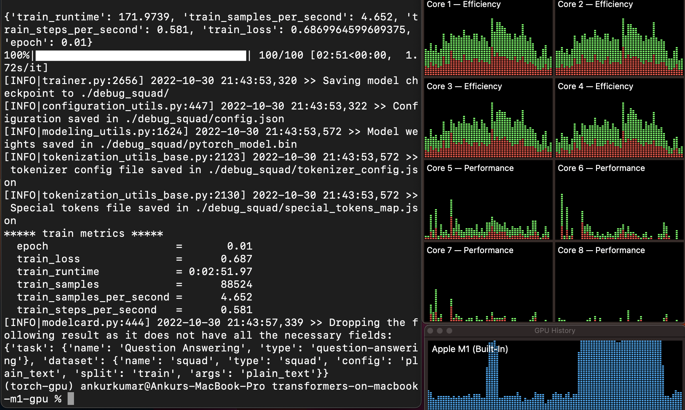
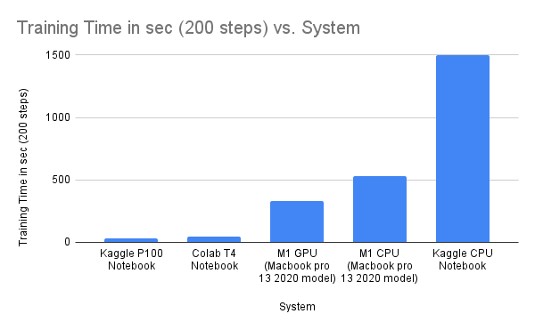

# transformers-on-macbook-m1-gpu

Around 1.5-2x improvement in training time over m1 cpu.



# Install Pytorch for Macbook M1 GPU

##  Step 1: Install Xcode
    $ xcode-select --install

##  Step 2: Setup a new conda environment
    $ conda create -n torch-gpu python=3.8
    $ conda activate torch-gpu

##  Step 3: Install Pytorch
    $ conda install pytorch torchvision torchaudio -c pytorch-nightly

    # If not working with conda then try pip
    $ pip3 install --pre torch torchvision torchaudio --extra-index-url https://download.pytorch.org/whl/nightly/cpu

## Step 4: Sanity Check

```python
import torch
import math
# this ensures that the current MacOS version is at least 12.3+
print(torch.backends.mps.is_available())
# this ensures that the current current PyTorch installation was built with MPS activated.
print(torch.backends.mps.is_built())
```

# Hugging Face transformers Installation

## Step 1: Install Rust

    $ curl — proto ‘=https’ — tlsv1.2 -sSf https://sh.rustup.rs | sh

## Step 2: Install transformers

    $ pip install transformers


# Train QA model

    $ sh run.sh
    
# Benchmark

| System | Training Time (200 steps)    |
| :---:   | :---: |
| Kaggle P100 Notebook | ~32 sec   |
| Colab T4 Notebook | ~47 sec  |
| M1 GPU (Macbook pro 13 2020 model) | ~328 sec |
| M1 CPU (Macbook pro 13 2020 model) | ~527 sec  |
| Kaggle CPU Notebook | ~1500 sec  |



# Reference

1. https://pytorch.org
2. https://towardsdatascience.com/installing-pytorch-on-apple-m1-chip-with-gpu-acceleration-3351dc44d67c
3. https://jamescalam.medium.com/hugging-face-and-sentence-transformers-on-m1-macs-4b12e40c21ce
